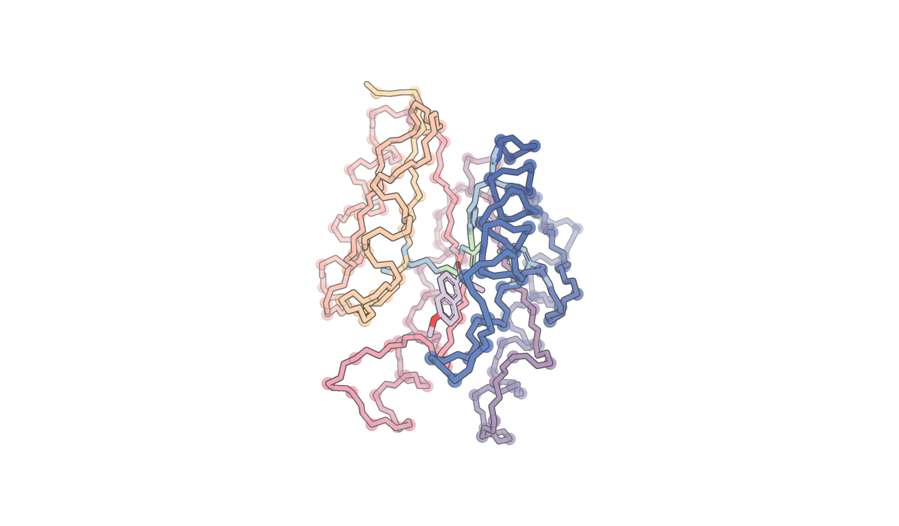

# RFdiffusion2 for Molecular Interfaces

Open source code for RFdiffusion2 for Molecular Interfaces, an extension of [RFD2](https://www.nature.com/articles/s41592-025-02975-x), as described in the following [bioRxiv pre-print](https://www.biorxiv.org/content/10.1101/2025.09.29.678898v2).

# Quick start

You need Git, `curl`, an NVIDIA GPU, and [Apptainer](https://apptainer.org/docs/admin/main/installation.html).

1. Clone the repository and its submodules:

   ```bash
   git clone https://github.com/RosettaCommons/RFDiffusion2_all_the_code.git
   cd RFDiffusion2_all_the_code
   git submodule update --init --recursive
   export REPO_DIR="$PWD"
   ```

2. Pull the prebuilt container from [Docker Hub](https://hub.docker.com/r/magnusbauer/rfdiffusion2-apptainer):

   ```bash
   apptainer pull \
       rf_diffusion/exec/rf_diffusion_aa.sif \
       oras://docker.io/magnusbauer/rfdiffusion2-apptainer:cuda12.8-torch2.8.0-20260818
   ```

   The SIF SHA-256 is `f8bdfd4e9570fe4091931512a2570b71729a110efdb7b908c7f2c67cfbb9b025`. Use the `latest` tag instead if you want the newest published image.

3. Download the model weights:

   ```bash
   ./rf_diffusion/exec/download_model_weights.sh
   export RFDIFFUSION2_WEIGHTS_DIR="$REPO_DIR/rf_diffusion/model_weights"
   ```

   This downloads the RFdiffusion2 weights (`RFD_173.pt` and `RFD_140.pt`) and the RFdiffusion2-MI weight (`ppi_robust_struct.pt`) into `rf_diffusion/model_weights`. Existing files are skipped; use `--force` to replace them. If you use `--output-dir DIR`, set `RFDIFFUSION2_WEIGHTS_DIR` to the absolute path of that directory.

4. Confirm the container starts:

   ```bash
   apptainer exec rf_diffusion/exec/rf_diffusion_aa.sif \
       python -c 'import torch; print("PyTorch", torch.__version__, "CUDA", torch.version.cuda)'
   ```

## Build the container locally instead

To build the image from `rf_diffusion/exec/rf_diffusion_aa.spec` rather than downloading it:

```bash
./rf_diffusion/exec/build_rf_diffusion_aa_apptainer.sh
```

The default build contains the runtime dependencies but not this repository or the model weights. Run with `--with-repo --with-weights` for a self-contained image, or `--help` for all options.

## Running repository scripts

Executable scripts such as `rf_diffusion/run_inference.py` and `rf_diffusion/benchmark/pipeline.py` automatically launch the container, set `PYTHONPATH`, and default `RFDIFFUSION2_WEIGHTS_DIR` to `rf_diffusion/model_weights`. If the SIF is missing, the wrapper offers to download it. For scripts without the container shebang, run:

```bash
apptainer exec --nv \
    --env PYTHONPATH="$REPO_DIR" \
    --env RFDIFFUSION2_WEIGHTS_DIR="$REPO_DIR/rf_diffusion/model_weights" \
    rf_diffusion/exec/rf_diffusion_aa.sif python path/to/script.py ...
```

Set `RFDIFFUSION2_SIF_PATH` to use another SIF or `RFDIFFUSION2_APPTAINER_URI` to pull from another OCI URI.

The examples below are wired to the downloaded checkpoints: small demos use `RFD_173.pt`, the full enzyme benchmark uses `RFD_140.pt`, and the protein-interface benchmark uses `ppi_robust_struct.pt`.

# Simple inference pipeline run
## Running inference
To run a demo of some of the inference capabilities, including enzyme design from tip atoms, enzyme design from tip atoms of unknown sequence position, ligand binder design, traditional contiguous motif scaffolding, and molecular glue design (binder to protein:small_molecule complex).  (See `$REPO_DIR/rf_diffusion/benchmark/demo.json` for how these tasks are declared)

`$REPO_DIR/rf_diffusion/benchmark/pipeline.py --config-name=demo_only_design`

This configuration loads `$RFDIFFUSION2_WEIGHTS_DIR/RFD_173.pt`.

This will print the directory the designs are created in:
ic| conf.outdir: OUTDIR

Once the pipeline finishes (check sjobs for an array job named `sweep_hyperparameters`), view the designs:

## Viewing designs
First, start pymol:

`PYMOL_RPCHOST='0.0.0.0' PYMOL_BIN -R`

`PYMOL_BIN` on the digs is: `/software/pymol-2/bin/pymol`

Find your hostname with
`hostname -I`

Then run:
`$REPO_DIR/rf_diffusion/dev/show_bench.py --clear=True 'OUTDIR/*.pdb' --pymol_url=http://HOSTNAME:9123`

You should see multiple designs (such as this enzyme design) render in your pymol session:


To render some of the nice colors, you may need to add the files in `pymol_config` to your `.pymolrc`

## Running inference (OUTSIDE OF DIGS)
To run a simple pipeline with no mpnn/scoring for the tip atom case:

`$REPO_DIR/rf_diffusion/benchmark/pipeline.py --config-name=retroaldolase_demo_nodigs`

This configuration also loads `$RFDIFFUSION2_WEIGHTS_DIR/RFD_173.pt`.

## Running catalytic constraint benchmarking

Put your un-mpnned designs in a folder, call it $MY_FOLDER

Each design is expected to be a .pdb, with a .trb file with the same file prefix.
The trb file is expected to contain a pickle that has the following structure:

```
{'con_hal_pdb_idx': [('A', 114), ('A', 115), ('A', 85)],
 'con_ref_pdb_idx': [('A', 1), ('A', 2), ('A', 3)],
 'con_ref_idx0': array([0, 1, 2]),
 'con_hal_idx0': array([113, 114,  84]),
 'config': {
	'contigmap': {'contig_atoms': "{'A1':'C','A2':'N,CA,CB,OG','A3':'NE2,CE1,ND1,CG,CD2'}"},
  	'inference': {
		'input_pdb': '/path/to/input/siteC.pdb',
   		'ligand': 'mu2'
		}
	}
}
```

Run python `./benchmark/pipeline.py --config-name=catalytic_constraints_from_designs outdir=$MY_FOLDER`

This will produce a metrics dataframe: $METRICS_DATAFRAME_PATH

Use $METRICS_DATAFRAME_PATH in the provided analysis notebook `notebooks/analyze_catalytic_constraints.ipynb` to analyze success on the various catalytic constraints.

If you do not have the dependencies to run this notebook in your default kernel, use this sif as a kernel `rf_diffusion/exec/rf_diffusion_aa.sif` following instructions in https://wiki.ipd.uw.edu/it/digs/apptainer#jupyter

## Running catalytic constraint design + benchmarking
`$REPO_DIR/rf_diffusion/benchmark/pipeline.py --config-name=sh_benchmark_1_tip-true_selfcond-false_seqposition_truefalse_T150`

This configuration loads `$RFDIFFUSION2_WEIGHTS_DIR/RFD_173.pt`.

This will make 50 * 2 [+/- sequence position] * 6 [6 different active site descriptions] = 600 designs = 600 * 8 (MPNN runs/design) = 4800 sequences

All motifs are tip atom motifs for 150 timesteps with no self-conditioning

# Mid-trajectory filters

Sometimes your diffusion goals are hard for the network perform, but easy for you to evaluate. An even better case is where it's easy to tell if the network **is going to get it wrong** very early in the trajectory.

Mid-trajectory filters allow you to detect and restart trajectories that are going poorly.

## Universal filter flags

These flags control the behavior of how your run will progress. `filter.max_steps_per_design` might be the safer of the two since it can give you an upperbound on your runtime.
```
filters:
  max_attempts_per_design: 10 # If filters enabled, for a given design, try at most this many times before giving up
  max_steps_per_design: 100 # If filters enabled, for a given design, take at most this many diffusion steps (cumulative across failures) before giving up
```

These flags control the scorefile that is produced from filters. Typically you'll either use the scorefile to save scores so you know which outputs are best or in preparation to figure out how to filter.

```
inference:
  write_scorefile: True # Write a scorefile if there are scores to write
  scorefile_delimiter: ' ' # ',' implies .csv, ' ' implies .sc
  write_scores_to_trb: True # If scores are present, write to trb
```

## Filter instantiation

To add filters to your runs, you need to add them to `filters.names` and then configure them through `filters.configs`

Here's an example where we'll add a ChainBreak filter at t=20:

```
filters:
  names:
    - ChainBreak
  configs:
    ChainBreak:
      t: 20
      C_N_dist_limit: 1.8
```

If you want to have multiple copies of the same kind of filter. You can use `NewName:ClassName` to rename them in the names.

```
filters:
  names:
    - EarlyBreaks:ChainBreak
  configs:
    EarlyBreaks:
      t: '40,30,25'
      C_N_dist_limit: 2.5
```

In general, all filters have the following default fields:

```
t: # A comma separated list of t steps to activate at
suffix: # A string suffix to add to this value in the scorefile
prefix: # A string prefix to add to this value in the scorefile
verbose: # A bool (default false) as to whether or not this filter should print logging info
```

## Available Filters

This list will almost certainly be out of date at some point. `rf_diffusion/rf_diffusion/filters.py` will always be up-to-date.

### InterchainClashFilter filter

Look for overlapping protein backbones between chains

Configs:
```

chainA -- Which is the first chain we'll look at. None for all
chainB -- Which is the second chain we'll look at. None for all
max_bb_clashes -- How many backbone clashes are acceptable between two chains
clash_dist -- At what distance do we consider CAs to be clashing
use_px0 -- Default True. Use px0 as the structure to look for clashes in
```

Reports:
```
max_clashes -- The most backbone clashes we found between two chains
```

### ChainBreak filter

Finds the largest C->N atom gap in your protein

Configs:
```
C_N_dist_limit -- The limit (in angstroms) at which this filter will fail. (1.7 is a pretty good choice)
monitor_chains -- A string of comma separated numbers (starting at 0) of which chains to monitor. Binder design would use '0'
use_px0 -- Default True. Use px0 as the structure to look for chainbreak in
```

Reports:
```
max_chain_gap -- The largest C->N atom gap in the chains we are monitoring
```

### BBGPSatisfaction filter

Determines the satisfaction level of your Backbone Guideposts. Currently assumes all guidepost are backbone.

Configs:
```
gp_max_error_cut -- The limit (in angstroms) of the worst CA-CA guidepost mismatch that's allowable
gp_rmsd_cut -- The limit (in angstroms) of the RMSD of all CA-CA guidepost matches that's allowable
use_px0 -- Default True. Use px0 as the structure to look for chainbreak in
```

Reports:
```
gp_max_error -- The worst CA-CA guidepost mismatch
gp_rmsd -- The RMSD of all CA-CA guidepost matches
```

# Benchmarking guide

The ODE solver returns the guideposted, atomized protein.

The backbone is idealized.

The protein is deatomized.

The guideposts are placed.  A greedy search matches each guidepost to its nearest remaining C-alpha.
If `inference.guidepost_xyz_as_design_bb == True`, then the guidepost coordinates overwrite the matched backbone.  Otherwise only the sidechain (including C-beta) coordinates of the guidepost are used.

If `inference.idealize_sidechain_outputs == True` then all atomized sidechains are idealized.  This amounts to finding the set of torsions angles that minimizes the RMSD between the unidealized residue and the residue reconstructed from those torsion angles.  Note: these torsions are the full rf2aa torsion set which includes not only torsions but also bends and twists e.g. C-Beta bend which can adopt values which would be of higher-strain than that seen in nature.

The protein at this point has sequence and structure for the motif regions but only backbone (N,Ca,C,O,C-Beta) coordinates for diffused residues (as well as any non-protein components e.g. small molecules)

Sequence is fit using LigandMPNN in a ligand-aware, motif-rotamer-aware mode.  LigandMPNN also performs packing.  LigandMPNN attempts to keep the motif rotamers unchanged, however the pack uses a more conservative set of torsions than rf2aa (i.e. fewer DoF) to pack the rotamers and thus there is often some deviation between the rf2aa-idealized and ligandmpnn-idealized motif rotamers.  The idealization gap between the diffusion-output rotamer set and the rf2aa-idealized rotamer set can be found with metrics key: `metrics.IdealizedResidueRMSD.rmsd_constellation`.  The corresponding gap between the rf2aa-idealized (or not idealized if `inference.idealize_sidechain_outputs == False`) rotamer set and the ligandmpnn-idealized rotamer set can be found with metrics key: `motif_ideality_diff`.

Motif recapitulation metrics:

The following metrics follow a formula:

contig_rmsd_a_b_s

a,b: the proteins being compared:
	- des: The MPNN packed protein
	- pred: The AF2 prediction
	- ref: The input PDB
With the caveat that 'ref' is always omitted from the name.

s: the comparison type:
	- '': backbone (N, Ca, C)
	- 'c_alpha': Ca
	- 'full_atom': All heavy atoms
	- 'motif_atom': Only motif heavy atoms


# Running the enzyme benchmark

We crawled M-CSA for 41 enzymes where all reactants and products are present to create this benchmark.  Only positon-agnostic tip atoms and partial ligand positions are provided to the network.

100 designs for each case are created.

Run it with:

`$REPO_DIR/rf_diffusion/benchmark/pipeline.py --config-name=enzyme_bench_n41`

This configuration loads `$RFDIFFUSION2_WEIGHTS_DIR/RFD_140.pt`.

# Debugging

## pipeline.py
If your outdir is `/a/b/c/` then slurm logs appear at: `/a/b/SLURMJOBID_SLURMJOBARRAYINDEX_jobtype.log`

# Protein-interface design

Generate length-100 binders against the five protein-interface benchmark targets with the published RFdiffusion2-MI checkpoint:

`$REPO_DIR/rf_diffusion/benchmark/pipeline.py --config-name=ppi_rf_bench`

This configuration loads `$RFDIFFUSION2_WEIGHTS_DIR/ppi_robust_struct.pt`.

To visualize the trajectories created during the "sweep" step in PYMOL:
`$REPO_DIR/rf_diffusion/dev/show_bench.py --clear=1 'YOUR_OUTPUT_DIR_HERE/*.trb' --key=name --ppi=1 --des=0`

To visualize the designs as cartoons once the MPNN step is complete in PYMOL:
`$REPO_DIR/rf_diffusion/dev/show_bench.py --clear=1 'YOUR_OUTPUT_DIR_HERE/*.trb' --key=name --ppi=1 --mpnn_packed=1 --des=0 --cartoon=1 --structs='{}'`

## Legacy CA RFdiffusion

The CA diffusion and refinement scripts require the separate `BFF_7` and `BFF_3` checkpoint architectures. Those checkpoints are not interchangeable with the published RFdiffusion2 and RFdiffusion2-MI weights downloaded above, so the legacy CA workflow is not part of this quick start.

## Citations

Please cite the RFdiffusion2 for Molecular Interfaces pre-print:

```bibtex
@article{Bauer2025.09.29.678898,
  author={Bauer, Magnus S and Zhang, Jason Z and Wu, Kejia and Lee, Gyu Rie and Coventry, Brian and Silvestri, Isabella M and Klupt, Kody A and Shi, Jiuhan and Brent, Rafael I and Li, Xinting and Moller, Carolina and Roullier, Nicole and Vafeados, Dionne K and Kalvet, Indrek and Skotheim, Rebecca K and Zhu, Siyu and Motmaen, Amir and Herrmann, Luca C and Sturmfels, Pascal and Tischer, Doug and Altae-Tran, Han and Juergens, David and Krishna, Rohith and Ahern, Woody and Yim, Jason and Bera, Asim K and Kang, Alex and Joyce, Emily and Lu, Andrew and Stewart, Lance and DiMaio, Frank and Mudumbi, Krishna C and Baker, David},
  title={De novo design of phosphotyrosine peptide binders},
  elocation-id={2025.09.29.678898},
  year={2026},
  doi={10.1101/2025.09.29.678898},
  publisher={Cold Spring Harbor Laboratory}
}
```

This code extends RFdiffusion2; please also cite its pre-print:

```bibtex
@article{ahern2025atom,
  title={Atom level enzyme active site scaffolding using RFdiffusion2},
  author={Ahern, Woody and Yim, Jason and Tischer, Doug and Salike, Saman and Woodbury, Seth M and Kim, Donghyo and Kalvet, Indrek and Kipnis, Yakov and Coventry, Brian and Altae-Tran, Han Raut and others},
  journal={bioRxiv},
  pages={2025--04},
  year={2025},
  publisher={Cold Spring Harbor Laboratory}
}
```
